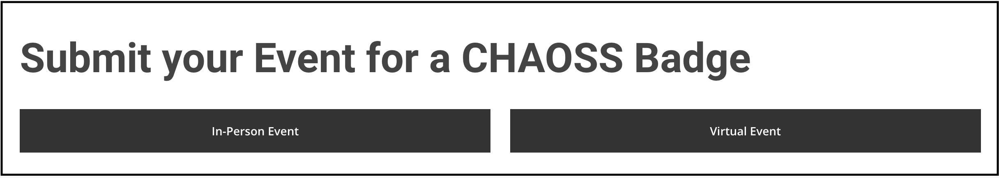

# Applying for a badge

## Apply D&I Badge for what?


We are planning to have D&I badges for **technical events** and **open-source projects**. While currently, we only support D&I badge applications for **events.** Project applications will be covered in later versions.


### **Event Definition**

**Events** refer to tech get-togethers, conferences, festivals, and any other tech event that promote tech-related concepts, mostly off-line meetups, but digital events are also included given in certain circumstances. 

**As such, you can either apply D&I badge for an In-Person Event or a Virtual Event.**

**In-Person Events** refer to events happening in a physical meeting space where speakers and attendees always show up in person.

**Virtual Events** are events holding online, speakers and attendees interact via computers and meeting tools like zoom, skype, and so on.

## Apply For Event Badge

If you are one of the organizers of an event that is open source technologies and systems related, we encourage you to apply. We expect that it will take an hour or two to prepare all the required information and complete the application. First, please check whether your event meets all the following initial requirements, then follow the submission instructions.

### Submission Requirements

**Event status-related requirements**

* The event must be about Open Source technologies and practices.
* You should be an organizer of the Event you are applying for.

**Metric related requirements**

* The information about the event must be publicly available, such as on a website.
* Important metrics information must be available for potential attendees and speakers.
* The event must host a Code of Conduct on the website.

### Submission Guides

Please read the following documents first before applying:

* [Applicant role](https://github.com/badging/diversity-and-inclusion/blob/master/roles/applicant.md) 
* [Event submission requirements](https://github.com/badging/event-diversity-and-inclusion/blob/master/submission/requirements.md)
* [Event submission guideline](https://github.com/badging/event-diversity-and-inclusion/blob/master/submission/guidelines.md)

**Click the Button Below to Apply for Event Badge**

[![Alt Text](https://img.shields.io/badge/D%26I-Click%20Here%20To%20Apply-passing?style=flat-square&link=http://left&link=https://github.com/badging/event-diversity-and-inclusion/blob/master/submission/guidelines.md&labelColor=583586&logo=data:image/svg+xml;base64,PHN2ZyB2ZXJzaW9uPSIxLjEiIHhtbG5zPSJodHRwOi8vd3d3LnczLm9yZy8yMDAwL3N2ZyIgdmlld0JveD0iMCAwIDI1MCAyNTAiPgo8cGF0aCBmaWxsPSIjMUM5QkQ2IiBkPSJNOTcuMSw0OS4zYzE4LTYuNywzNy44LTYuOCw1NS45LTAuMmwxNy41LTMwLjJjLTI5LTEyLjMtNjEuOC0xMi4yLTkwLjgsMC4zTDk3LjEsNDkuM3oiLz4KPHBhdGggZmlsbD0iIzZBQzdCOSIgZD0iTTE5NC42LDMyLjhMMTc3LjIsNjNjMTQuOCwxMi4zLDI0LjcsMjkuNSwyNy45LDQ4LjVoMzQuOUMyMzYuMiw4MC4yLDIxOS45LDUxLjcsMTk0LjYsMzIuOHoiLz4KPHBhdGggZmlsbD0iI0JGOUNDOSIgZD0iTTIwNC45LDEzOS40Yy03LjksNDMuOS00OS45LDczLTkzLjgsNjUuMWMtMTMuOC0yLjUtMjYuOC04LjYtMzcuNS0xNy42bC0yNi44LDIyLjQKCWM0Ni42LDQzLjQsMTE5LjUsNDAuOSwxNjIuOS01LjdjMTYuNS0xNy43LDI3LTQwLjIsMzAuMS02NC4ySDIwNC45eiIvPgo8cGF0aCBmaWxsPSIjRDYxRDVGIiBkPSJNNTUuNiwxNjUuNkMzNS45LDEzMS44LDQzLjMsODguOCw3My4xLDYzLjVMNTUuNywzMy4yQzcuNSw2OS44LTQuMiwxMzcuNCwyOC44LDE4OEw1NS42LDE2NS42eiIvPgo8L3N2Zz4K)](https://chaoss.community/diversity-and-inclusion-badging/)

By clicking the button you will be navigated to [the CHAOSS Event Badging submission form](https://chaoss.community/diversity-and-inclusion-badging/).  As an applicant, 

You will see on the website that there are two submission choices: 

* In-Person Event 
* Virtual Event

We make one distinction between virtual events and in-person events. The Virtual Event does not have the ability to measure the [Family Friendliness](https://chaoss.community/metric-family-friendliness/) metric because this is not currently a concern for virtual events.

**The Submission Workflow**

Please fill out the web form with the kind of event you have chosen to your best ability, provide as much information as you want, and click "Submit".



You will be redirected to GitHub,  and an Issue will be generated under the`event-diversity-and-inclusion`badging repository with the information you provided on the web form. **You must use your GitHub account to finalize the issue on their Website by clicking "Create New Issue", or your submission will be invalid.**

Once the Issue is successfully created, a minimum of two reviewers will then be assigned to review your issue and assess the event's D&I Practices using a [review checklist.](https://app.gitbook.com/@chaoss-project/s/badging/~/drafts/-MHfMz780wz3WnO_1TbA/reviewing/review-checklist)

**Communicate with reviewers and moderators**

Constantly pay attention to the issue you submitted before finally acquire the D&I badge. Reviewers may leave suggestions in the comment or require more information, keep continuous communication with reviewers within the issue.

At any time during the review process, the current Badge status can be checked by using `/result` command in an issue comment. See [an example.](https://github.com/badging/event-diversity-and-inclusion/issues/45#issuecomment-674542479)


The commands work only if no other content accompanies them on the issue comment.


Connect with the `@badging/badging-moderators` team when you are satisfied with the result, or at a point in time where you wish to end the review.

**Acquire the Badge**

The review ends when a moderator confirms that the application and checklists align with everything and close the issue with the  `/end` command. Two badge links will be generated as an issue comment at the same time the issue closes. 

Here is an example of how the badge will look :




```text

```



```

```



* Embed the **Markdown Badge Link** if you wish to display the badge on any markdown File.
* Embed the **HTML Badge Link** on an HTML page if you wish to display the badge on your event website.

### Badge levels

Four statuses exist for the Diversity and Inclusion Event Badging:

| Level | Badge | Percentage of Requirements Met |
| :--- | :--- | :--- |
| Pending |  | Less than 40% |
| Passing |  | Greater than or equal to 40% and less than 60% |
| Silver |  | Greater than or equal to 60% and less than 80% |
| Gold |  | Greater than 80% |

Badges are assigned according to how the Reviewers mark out the [review checklist](https://github.com/badging/event-diversity-and-inclusion/blob/master/.github/checklist.md) according to the information initially filled in by the Applicant.

The percentages are calculated excluding the initial checks, based on the average of checklists of at least two reviewers.

### Metrics For Event Badge

All the metrics you are going to encounter during the submission process are defined by [CHAOSS D&I Working Group](https://github.com/chaoss/wg-diversity-inclusion/). Metrics used for event badge come from the [Event Diversity ](https://chaoss.community/metrics/#user-content-focus-area---event-diversity)focusing area. Here is the list of five metrics that belong to Event Diversity:

| Name | Question |
| :--- | :--- |
| [Speaker Demographics](https://github.com/chaoss/wg-diversity-inclusion/blob/master/focus-areas/events/speaker-demographics.md) | How well does the speaker lineup for the event represent a diverse set of demographics? |
| [Attendees Demographics](https://github.com/chaoss/wg-diversity-inclusion/blob/master/focus-areas/events/attendee-demographics.md) | How diverse are the attendees? |
| [Diversity Access Tickets](https://github.com/chaoss/wg-diversity-inclusion/blob/master/focus-areas/events/diversity-tickets.md) | How are Diversity Access Tickets used to support diversity and inclusion for an event? |
| [Code of Conduct at Event](https://github.com/chaoss/wg-diversity-inclusion/blob/master/focus-areas/events/event-code-of-conduct.md) | How does the Code of Conduct for events support diversity and inclusion? |
| [Family Friendliness](https://github.com/chaoss/wg-diversity-inclusion/blob/master/focus-areas/events/family-friendly.md) | How does enabling families to attend together support diversity and inclusion of the event? |

### 

### 

